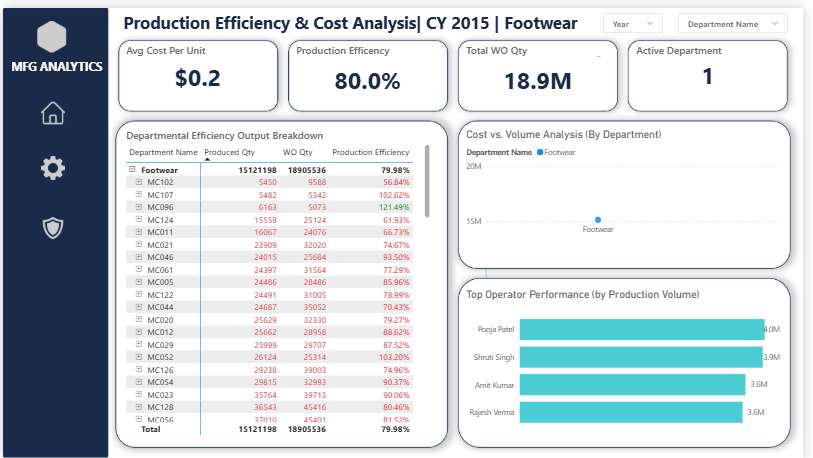
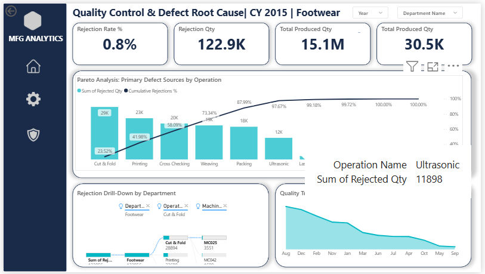

# Manufacturing Operations & Quality Dashboard


## 📊 Project Overview
This Power BI dashboard analyzes manufacturing data to improve **Production Efficiency** and reduce **Defect Rates**. It provides actionable insights into machine performance, cost variance, and quality control (Pareto analysis).

**Live Project:** 

## 🖼️ Dashboard Visuals

### 1. Production Performance Report (Executive View)
*Tracking monthly volume trends, revenue, and defect rates.*


### 2. Production Efficiency & Cost Analysis
*Detailed breakdown of machine efficiency, cost per unit, and operator performance.*



### 3. Quality Control & Root Cause Analysis
*Using Decomposition Trees and Pareto Charts to identify primary defect sources.*


---

## 🛠️ Tools Used
* **Power BI:** Data visualization, DAX measures, Bookmarks, Page Navigation.
* **Data Transformation:** Power Query for cleaning raw manufacturing logs.
* **Data Modeling:** Star Schema (connecting Fact tables to Dimension tables).

## 💡 Key Insights Delivered
1.  **Defect Trends:** Identified a spike in rejection rates in **August**, allowing for targeted investigation.
2.  **Root Cause:** The "Cut & Fold" operation was responsible for **25%** of all defects (Pareto Analysis).
3.  **Efficiency:** Tracked Departmental Efficiency (Target: 80% vs Actual: 79.8%) to monitor machine downtime.

## 📉 Key Metrics (DAX)
Below are the primary DAX formulas used to calculate the KPIs:
## 📉 Key Metrics (DAX)
* `Rejection Rate %` = (Total Rejected Qty / Total Produced Qty)
* `OTD %` = (On-Time Orders / Total Orders)
* `Cost Variance` = (Standard Cost - Actual Cost)

**1. Production Efficiency %**
> Measures actual output against the standard target.
```dax
Production Efficiency % = DIVIDE([Total Produced Qty], [Target Qty], 0)

